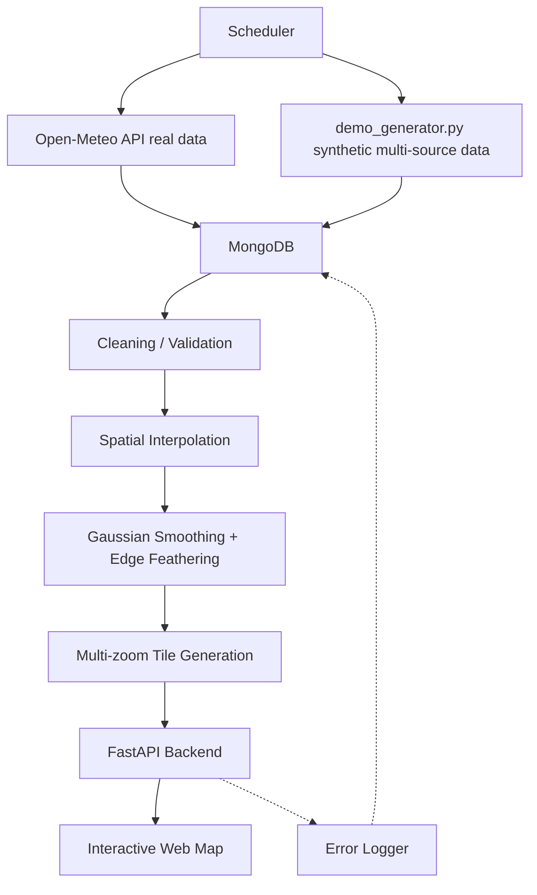

<div align="center">


<br>

[](https://git.io/typing-svg)

<br>


**[🔗 Live Demo](https://weatherwalay-data-pipeline.onrender.com)** &nbsp;•&nbsp; **[📖 API Docs](https://weatherwalay-data-pipeline.onrender.com/docs)** &nbsp;•&nbsp; **[👤 Author](#-author)**

</div>

> A weather data engineering pipeline covering spatial interpolation, a FastAPI backend, and interactive map tile generation — built during my internship in the Technology & Development department at WeatherWalay.

> ⏳ **Cold start notice:** hosted on a free-tier server that sleeps after 15 minutes of no visitors. If the link takes ~30–60 seconds to load the first time, that's expected — it's just waking up, not broken. It stays fast after that.

> 🔒 **Portfolio note:** This public repository excludes WeatherWalay's proprietary dataset, internal credentials, and private infrastructure. All configuration is environment-based (see `.env.example`).

<br>

## 📑 Table of Contents

- [Screenshots](#-screenshots)
- [What's Real vs. Simulated Data](#-whats-real-vs-simulated-data)
- [What I Built](#-what-i-built)
- [Architecture](#-architecture)
- [Method Validation](#-method-validation-experiments)
- [Tests](#-tests)
- [Project Structure](#-project-structure)
- [Setup](#-setup)
- [Notes](#-notes)
- [Author](#-author)

<br>

## 📸 Screenshots

<div align="center">

**Temperature layer**


**Humidity layer, different source**


**Wind Speed layer**


*Interactive weather map — source/variable switching, hourly timeline, and adjustable layer opacity, served by `api.py`. Switching source or variable pulls a different interpolated tile set live.*

**FastAPI auto-generated docs (`/docs`)**


*Every route (`/sources`, `/map/{source}/{variable}`, `/compare`, `/query`, etc.) is auto-documented and testable directly from the browser — no Postman needed.*

</div>

<div align="right">

[⬆ back to top](#-table-of-contents)

</div>

## 🌦️ What's Real vs. Simulated Data

This repo has two separate data paths, and it's worth being upfront about the difference:

| Script | Data Source | Type |
|---|---|---|
| `fetch_real_weather.py` | [Open-Meteo API](https://open-meteo.com/) (no key required) | ✅ Real, live weather data |
| `demo_generator.py` | Spatially-smooth synthetic generator | 🧪 Structural stand-in labeled with 10 real model names (ECM, ICON, GFS, WRF, etc.) |

`demo_generator.py` exists purely to demonstrate the multi-source pipeline architecture (separate MongoDB collections per source, hourly slots, multithreading) without needing 10 live model API subscriptions. **It is not real forecast data from those models** — it's a structural stand-in so the rest of the pipeline (interpolation, tiling, API) has realistic-shaped data to work against during development.

<div align="right">

[⬆ back to top](#-table-of-contents)

</div>

## 🛠️ What I Built

- [x] **Data ingestion** — real data via Open-Meteo, or structural demo data via the synthetic generator, both landing in MongoDB.
- [x] **Spatial interpolation** — converts scattered point observations into continuous grid surfaces (cubic interpolation with nearest-neighbor fallback, Gaussian smoothing, edge feathering).
- [x] **Map tile generation** — renders interpolated grids into a Turbo-colormap tile set across multiple zoom levels.
- [x] **FastAPI backend** — serves sources, variables, hours, maps, zoom tiles, point queries, source comparisons, and pipeline error logs.
- [x] **Method research** (`experiments/`) — leave-one-out cross-validation comparing IDW, RBF, Ordinary Kriging, and Clough–Tocher interpolation against real station data, with automatic outlier detection and per-variable normalized-MAE scoring to pick the best method.
- [x] **Scheduling & logging** — an hourly automation loop with MongoDB-backed error/success logging.

<div align="right">

[⬆ back to top](#-table-of-contents)

</div>

## 🏗️ Architecture



<div align="right">

[⬆ back to top](#-table-of-contents)

</div>

## 🔬 Method Validation (`experiments/`)

Leave-one-out validation: one station's data is withheld, the remaining stations' real values estimate what it should be, and the estimate is compared against the real value (MAE). Repeated independently for every station.

Errors are normalized per-variable (`MAE ÷ variable's data range`) so temperature error (°C) and humidity error (%) can be fairly compared on the same 0–1 scale. This normalization, plus automatic outlier detection (stations >2 standard deviations from the group's spatial center), lets the code report which interpolation method wins per variable rather than assuming one method fits all.

Covers: **IDW**, **RBF**, **Ordinary Kriging**, **Clough–Tocher**.

### Actual results (run against real Islamabad-region station data)

One station (`232283`) was automatically flagged and removed as a spatial outlier before validation. Normalized MAE per method, per variable:

| Method | avgtemp | mintemp | maxtemp | avghum | avgwind | **Overall** |
|---|---|---|---|---|---|---|
| **Kriging** ✅ | 0.0358 | 0.0359 | 0.0358 | 0.0586 | 0.1100 | **0.0552** |
| IDW | 0.0382 | 0.0383 | 0.0382 | 0.0660 | 0.1160 | 0.0593 |
| Clough–Tocher | 0.0465 | 0.0465 | 0.0465 | 0.0868 | 0.1564 | 0.0765 |
| RBF | 0.0456 | 0.0456 | 0.0457 | 0.0923 | 0.1690 | 0.0796 |

**Overall normalized MAE — lower is better:**

```
Kriging         ██████████░░░░░  0.0552  ✅ best
IDW             ███████████░░░░  0.0593
Clough–Tocher   ██████████████░  0.0765
RBF             ███████████████  0.0796
```


<details>
<summary><strong>📊 Auto-generated insights from this run (click to expand)</strong></summary>
<br>

- **Best overall method:** Kriging (normalized MAE = 0.0552)
- **Most predictable station:** `163746` (normalized MAE = 0.0202)
- **Least predictable station:** `234197` (normalized MAE = 0.0921)
- **Easiest variable to predict:** max temperature (0.0358)
- **Hardest variable to predict:** wind speed (0.1100) — makes physical sense, since wind is far more spatially chaotic than temperature.

</details>

<div align="right">

[⬆ back to top](#-table-of-contents)

</div>

## ✅ Tests

```bash
pip install -r requirements.txt pytest httpx
pytest tests/ -v
```

| File | Coverage |
|---|---|
| `tests/test_interpolation_math.py` | IDW, normalization, and outlier-detection logic directly (no database or dataset required) |
| `tests/test_api.py` | FastAPI endpoints that don't depend on a live MongoDB connection |

Both run automatically on every push via GitHub Actions (see badge above).

<div align="right">

[⬆ back to top](#-table-of-contents)

</div>

## 📁 Project Structure

<details>
<summary><strong>Click to expand full file tree</strong></summary>

```text
weatherwalay-data-pipeline/
├── api.py
├── demo_generator.py       # synthetic demo data — see "What's real vs simulated" above
├── error_logger.py
├── fetch_real_weather.py   # real data via Open-Meteo
├── interpolate.py
├── scheduler.py
├── requirements.txt
├── .env.example
├── .gitignore
├── LICENSE
├── README.md
├── experiments/            # interpolation method research & validation
│   ├── auto_outlier_detection.py
│   ├── clough_tocher.py
│   ├── idw.py
│   ├── interpolation_comparison.py
│   ├── kriging.py
│   └── normalization.py
├── tests/
│   ├── test_interpolation_math.py
│   └── test_api.py
└── data/
    └── README.md
```

</details>

<div align="right">

[⬆ back to top](#-table-of-contents)

</div>

## ⚙️ Setup

<details open>
<summary><strong>1. Clone</strong></summary>

```bash
git clone https://github.com/mhassanabbas/weatherwalay-data-pipeline.git
cd weatherwalay-data-pipeline
```

</details>

<details>
<summary><strong>2. Create a virtual environment</strong></summary>

```bash
python -m venv .venv
```

- **Windows:** `.venv\Scripts\activate`
- **macOS/Linux:** `source .venv/bin/activate`

</details>

<details>
<summary><strong>3. Install dependencies</strong></summary>

```bash
pip install -r requirements.txt
```

</details>

<details>
<summary><strong>4. Configure MongoDB</strong></summary>

Copy `.env.example` to `.env` and update `MONGO_URL` if your MongoDB instance isn't running locally on the default port.

</details>

<details>
<summary><strong>5. Get data flowing</strong></summary>

Real data:
```bash
python fetch_real_weather.py
```

or synthetic demo data (see note above):
```bash
python demo_generator.py
```

</details>

<details>
<summary><strong>6. Run the API</strong></summary>

```bash
uvicorn api:app --reload
```

</details>

<div align="right">

[⬆ back to top](#-table-of-contents)

</div>

## 📝 Notes

- No proprietary WeatherWalay dataset, credentials, or internal infrastructure details are included.
- `experiments/` scripts expect a local weather station CSV at `data/isl.csv` (not included — see `data/README.md`).
- Generated map tiles and local datasets are git-ignored.
- Licensed under MIT — see `LICENSE`.

## 💼 Internship Context

Developed during my internship in the Technology & Development department at WeatherWalay.

<br>

## 👤 Author

<div align="center">

**Hassan Abbas**
BS Information Technology, International Islamic University Islamabad

[](https://github.com/mhassanabbas)

<br>


</div>
