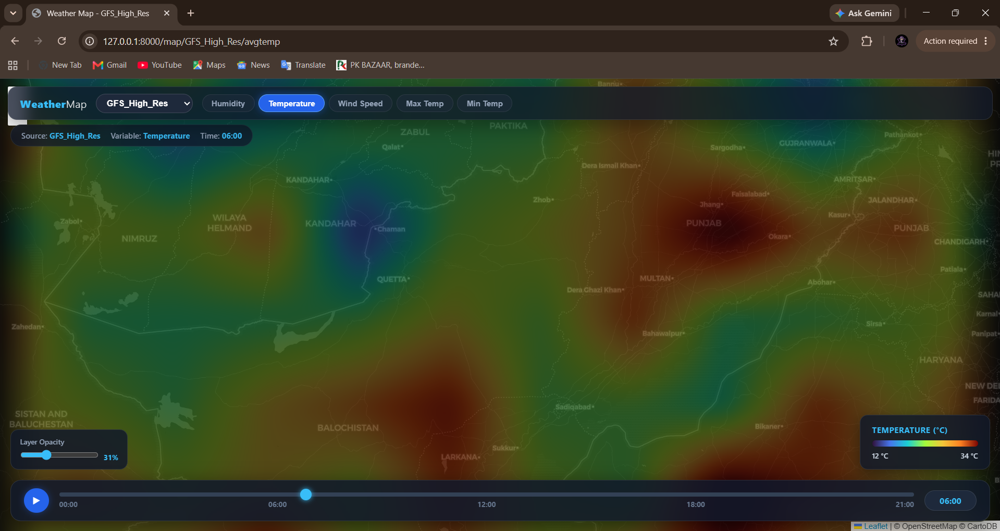
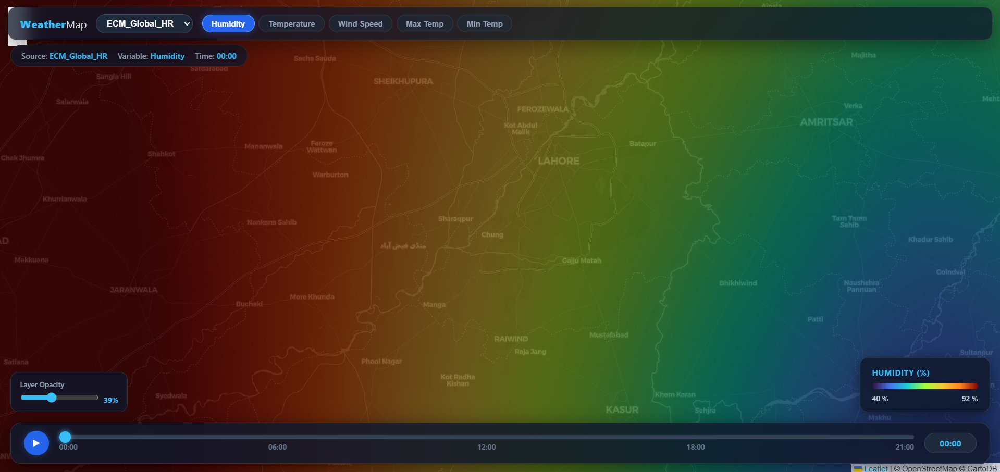
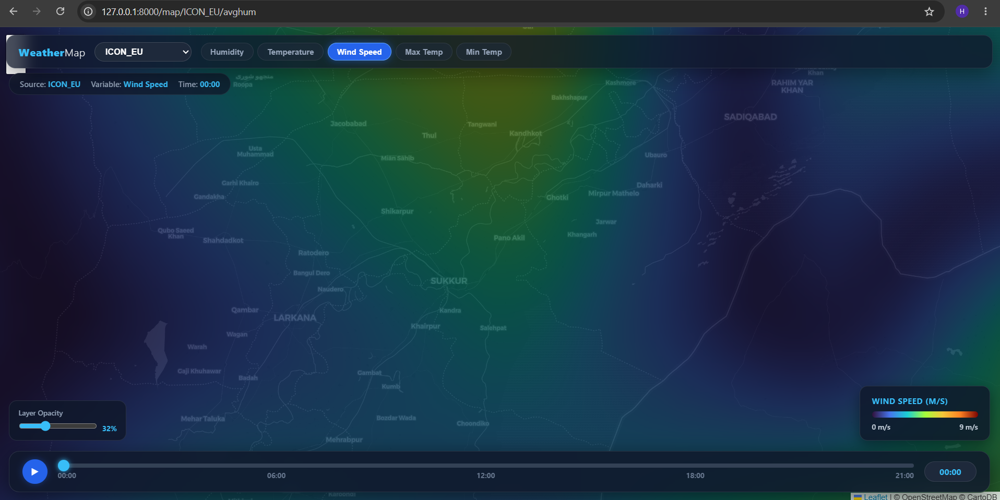
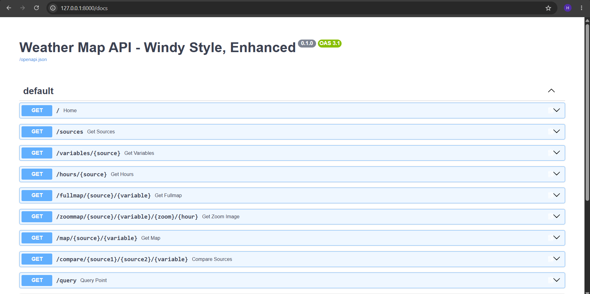
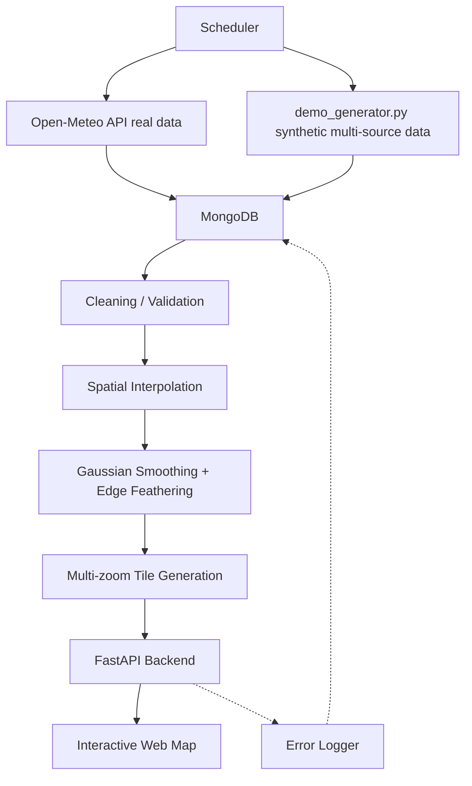
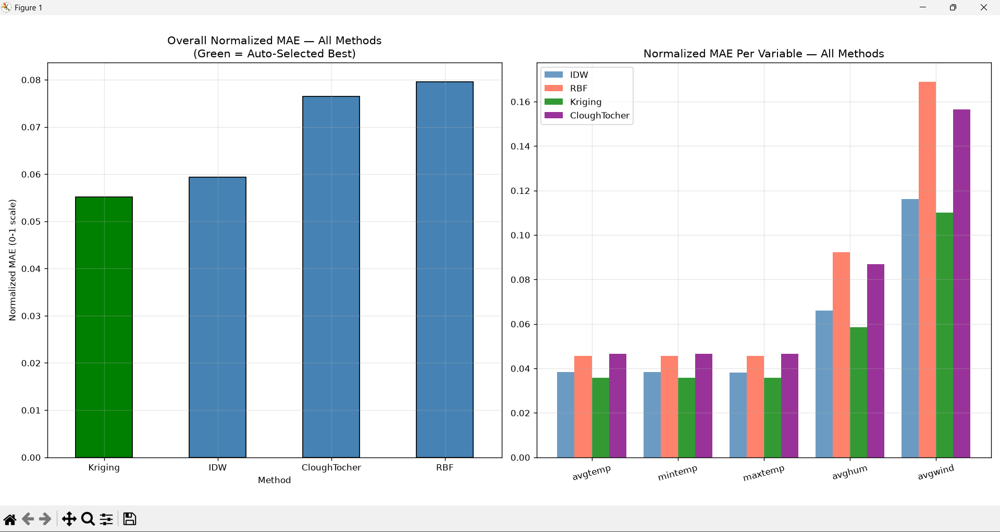

# WeatherWalay Data Pipeline


A weather data engineering pipeline covering spatial interpolation, a FastAPI backend, and interactive map tile generation — built during my internship in the Technology & Development department at WeatherWalay.

> **Portfolio note:** This public repository excludes WeatherWalay's proprietary dataset, internal credentials, and private infrastructure. All configuration is environment-based (see `.env.example`).

## Screenshots

**Temperature layer**


**Humidity layer, different source**


**Wind Speed layer**


*Interactive weather map — source/variable switching, hourly timeline, and adjustable layer opacity, served by `api.py`. Switching source or variable pulls a different interpolated tile set live.*

**FastAPI auto-generated docs (`/docs`)**


*Every route (`/sources`, `/map/{source}/{variable}`, `/compare`, `/query`, etc.) is auto-documented and testable directly from the browser — no Postman needed.*

## What's real vs. simulated data

This repo has two separate data paths, and it's worth being upfront about the difference:

- **`fetch_real_weather.py`** pulls genuine live weather data from the free [Open-Meteo API](https://open-meteo.com/) (no key required). This is real data.
- **`demo_generator.py`** produces spatially-smooth *synthetic* weather data, labeled with the names of 10 real forecast models (ECM, ICON, GFS, WRF, etc.) purely as a way to demonstrate the multi-source pipeline architecture (separate MongoDB collections per source, hourly slots, multithreading) without needing 10 live model API subscriptions. **It is not real forecast data from those models** — it's a structural stand-in so the rest of the pipeline (interpolation, tiling, API) has realistic-shaped data to work against during development.

## What I Built

1. **Data ingestion** — real data via Open-Meteo, or structural demo data via the synthetic generator, both landing in MongoDB.
2. **Spatial interpolation** — converts scattered point observations into continuous grid surfaces (cubic interpolation with nearest-neighbor fallback, Gaussian smoothing, edge feathering).
3. **Map tile generation** — renders interpolated grids into a Turbo-colormap tile set across multiple zoom levels.
4. **FastAPI backend** — serves sources, variables, hours, maps, zoom tiles, point queries, source comparisons, and pipeline error logs.
5. **Method research** (`experiments/`) — leave-one-out cross-validation comparing IDW, RBF, Ordinary Kriging, and Clough–Tocher interpolation against real station data, with automatic outlier detection and per-variable normalized-MAE scoring to pick the best method.
6. **Scheduling & logging** — an hourly automation loop with MongoDB-backed error/success logging.

## Architecture



## Method Validation (`experiments/`)

Leave-one-out validation: one station's data is withheld, the remaining stations' real values estimate what it should be, and the estimate is compared against the real value (MAE). Repeated independently for every station.

Errors are normalized per-variable (`MAE ÷ variable's data range`) so temperature error (°C) and humidity error (%) can be fairly compared on the same 0–1 scale. This normalization, plus automatic outlier detection (stations >2 standard deviations from the group's spatial center), lets the code report which interpolation method wins per variable rather than assuming one method fits all.

Covers: **IDW**, **RBF**, **Ordinary Kriging**, **Clough–Tocher**.

### Actual results (run against real Islamabad-region station data)

One station (`232283`) was automatically flagged and removed as a spatial outlier before validation. Normalized MAE per method, per variable:

| Method | avgtemp | mintemp | maxtemp | avghum | avgwind | **Overall** |
|---|---|---|---|---|---|---|
| **Kriging** | 0.0358 | 0.0359 | 0.0358 | 0.0586 | 0.1100 | **0.0552** ✅ |
| IDW | 0.0382 | 0.0383 | 0.0382 | 0.0660 | 0.1160 | 0.0593 |
| Clough–Tocher | 0.0465 | 0.0465 | 0.0465 | 0.0868 | 0.1564 | 0.0765 |
| RBF | 0.0456 | 0.0456 | 0.0457 | 0.0923 | 0.1690 | 0.0796 |



**Auto-generated insights from this run:**
- Best overall method: **Kriging** (normalized MAE = 0.0552)
- Most predictable station: `163746` (normalized MAE = 0.0202)
- Least predictable station: `234197` (normalized MAE = 0.0921)
- Easiest variable to predict: **max temperature** (0.0358)
- Hardest variable to predict: **wind speed** (0.1100) — makes physical sense, since wind is far more spatially chaotic than temperature.

## Tests

```bash
pip install -r requirements.txt pytest httpx
pytest tests/ -v
```

`tests/test_interpolation_math.py` covers the IDW, normalization, and outlier-detection logic directly (no database or dataset required). `tests/test_api.py` covers the FastAPI endpoints that don't depend on a live MongoDB connection. Both run automatically on every push via GitHub Actions (see badge above).

## Project Structure

```text
weatherwalay-data-pipeline/
├── api.py
├── demo_generator.py       # synthetic demo data — see "What's real vs simulated" above
├── error_logger.py
├── fetch_real_weather.py   # real data via Open-Meteo
├── interpolate.py
├── scheduler.py
├── requirements.txt
├── .env.example
├── .gitignore
├── LICENSE
├── README.md
├── experiments/            # interpolation method research & validation
│   ├── auto_outlier_detection.py
│   ├── clough_tocher.py
│   ├── idw.py
│   ├── interpolation_comparison.py
│   ├── kriging.py
│   └── normalization.py
├── tests/
│   ├── test_interpolation_math.py
│   └── test_api.py
└── data/
    └── README.md
```

## Setup

### 1. Clone

```bash
git clone https://github.com/mhassanabbas/weatherwalay-data-pipeline.git
cd weatherwalay-data-pipeline
```

### 2. Create a virtual environment

```bash
python -m venv .venv
```

Windows: `.venv\Scripts\activate`
macOS/Linux: `source .venv/bin/activate`

### 3. Install dependencies

```bash
pip install -r requirements.txt
```

### 4. Configure MongoDB

Copy `.env.example` to `.env` and update `MONGO_URL` if your MongoDB instance isn't running locally on the default port.

### 5. Get data flowing

Real data:
```bash
python fetch_real_weather.py
```
or synthetic demo data (see note above):
```bash
python demo_generator.py
```

### 6. Run the API

```bash
uvicorn api:app --reload
```

## Notes

- No proprietary WeatherWalay dataset, credentials, or internal infrastructure details are included.
- `experiments/` scripts expect a local weather station CSV at `data/isl.csv` (not included — see `data/README.md`).
- Generated map tiles and local datasets are git-ignored.
- Licensed under MIT — see `LICENSE`.

## Internship Context

Developed during my internship in the Technology & Development department at WeatherWalay.

## Author

**Hassan Abbas**
BS Information Technology, International Islamic University Islamabad
GitHub: [github.com/mhassanabbas](https://github.com/mhassanabbas)
